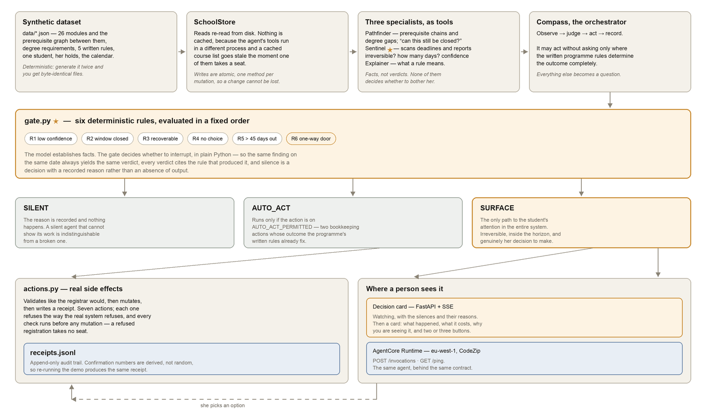

# Architecture

This document explains how Compass is put together and, more usefully, *why* —
including the alternatives that were considered and rejected.

For what Compass does and why it exists, see the [README](README.md).



*Generated by [`docs/make_architecture.py`](docs/make_architecture.py) — the
figure is code so it can be kept in step with the code.*

---

## The shape of the thing

```
                        ┌──────────────────────────────────────┐
                        │  data/*.json  — synthetic dataset    │
                        │  26 modules · prerequisite graph     │
                        │  degree requirements · 5 written     │
                        │  rules · one student · calendar ·    │
                        │  notices                             │
                        └──────────────────┬───────────────────┘
                                           │
                        ┌──────────────────▼───────────────────┐
                        │  SchoolStore                         │
                        │  reads re-read from disk; writes are │
                        │  atomic (temp file + rename)         │
                        └──────────────────┬───────────────────┘
                                           │
              ┌────────────────────────────┴───────────────────────────┐
              │  two transports, one list of tools                    │
              │                                                       │
              │   FastMCP server (stdio)        in-process @tool      │
              │   the deployment path           the test path         │
              │           └────────────┬──────────────┘               │
              └────────────────────────┼──────────────────────────────┘
                                       │
     ┌─────────────────────────────────▼─────────────────────────────────┐
     │  Pathfinder        Sentinel ★        Explainer                    │
     │  prereq chains     deadline scan     what a rule means            │
     │  degree gaps       consequence →     quote, do not guess          │
     │  "still fixable?"  {irreversible,                                 │
     │                     days, confidence, options}                    │
     └─────────────────────────────────┬─────────────────────────────────┘
                                       │  agents-as-tools
     ┌─────────────────────────────────▼─────────────────────────────────┐
     │  Compass (orchestrator)                                           │
     │  observe → judge → act → record                                   │
     └─────────────────────────────────┬─────────────────────────────────┘
                                       │
     ┌─────────────────────────────────▼─────────────────────────────────┐
     │  gate.py  ★  six deterministic rules, fixed order                 │
     │  R1 confidence · R2 closed · R3 recoverable · R4 no-choice        │
     │  R5 too-early · R6 one-way door                                   │
     │                                                                   │
     │  SILENT ──► reason recorded, nothing happens                      │
     │  AUTO_ACT ─► only if the action is on AUTO_ACT_PERMITTED          │
     │  SURFACE ─► the only path to the student                          │
     └─────────────────────────────────┬─────────────────────────────────┘
                                       │
     ┌─────────────────────────────────▼─────────────────────────────────┐
     │  actions.py — real side effects                                   │
     │  validate like the registrar, then mutate, then write a receipt   │
     └─────────────────────────────────┬─────────────────────────────────┘
                                       │
        ┌──────────────────────────────┴───────────────────────────┐
        │                                                          │
 ┌──────▼───────────────────────┐              ┌───────────────────▼──────┐
 │  Decision card (local)       │              │  AgentCore Runtime       │
 │  FastAPI + SSE               │              │  eu-west-1 · CodeZip     │
 │  silent → card → click →     │              │  POST /invocations       │
 │  executed → receipt          │              │  GET  /ping              │
 └──────────────────────────────┘              └──────────────────────────┘
```

---

## 1. The data layer

`SchoolStore` ([`src/compass/store.py`](src/compass/store.py)) is the single
source of truth for both access paths, so the fallback cannot drift from the
real thing.

**Reads re-read from disk. There is no in-process cache.** This was not the
first design, and the first design was wrong in a way that took a while to see.
The agent's tools and the orchestrator are different objects, and in the
deployed configuration they are in **different processes** — the MCP server is a
subprocess. A course list cached at construction goes stale the moment either
side takes a seat, and the failure is silent: the agent reports a registration
it did not make, or refuses one it did. Re-parsing a few kilobytes of JSON is
cheaper than any cache-invalidation scheme that would be needed to make caching
correct.

**Writes go through one method per mutation**, not through a mutated object.
`take_seat(code, delta)` reads the catalogue, patches the matching entry, and
writes atomically. The alternative — `course = store.course(code);
course.enrolled += 1; store.save_courses()` — mutates a throwaway copy and
writes the *unchanged* list back. It looks right, it passes review, and it
silently does nothing. Both `register_modules` and `drop_module` were rewritten
to use `take_seat` after this was caught by a test.

All writes are atomic: a temp file in the same directory, then `os.replace`.
A crash mid-write cannot leave a half-parsed student record.

### The dataset generator

`python -m compass.data.generate` is deterministic. Generate twice into
different directories and you get byte-identical files, which a test asserts.
That property is what makes the recorded demo and the test suite the same
artefact: when the video shows a €45 charge being offered, the test suite is
asserting on the same €45.

The demo date is fixed at `2026-09-28` inside `meta.json`, so "days until the
last safe action" is a stable number rather than a function of when you ran it.

---

## 2. The transport duality

The school's data is exposed two ways, and both decorate **the same function
objects** in `school_tools.py`:

| | `use_mcp=True` | `use_mcp=False` |
|---|---|---|
| Transport | FastMCP server on stdio, as a subprocess | in-process Strands `@tool` |
| Used by | the real configuration and the deployment | the test suite |
| Cost | a subprocess per agent | none |

This is deliberately not two implementations. `MCPClient(lambda:
stdio_client(...))` wraps the same functions the direct path decorates, so
"the fallback" is genuinely the same capabilities and not a second codebase
that can rot.

The **deterministic analysis tools are never behind the protocol boundary**.
`audit_degree_plan`, `term_load`, `days_from_today` and friends are Compass's own
arithmetic, not the school's data. They are added directly to every agent
regardless of transport, because the gate's correctness depends on their
exactness and they must keep working if the MCP server is unavailable.

---

## 3. The three agents

Each specialist has exactly one rule that keeps it honest, and the rule is in
the prompt because that is where the failure mode lives.

**Pathfinder** — prerequisite chains and degree gaps. *"Never do arithmetic in
your head."* It has `term_load`, `credits_remaining` and `audit_degree_plan`
available and is told to use them. The interesting tool is
`compare_specialisations`, which had to be rewritten: its first version counted
only modules *takeable today*, and therefore reported the quantitative stream as
impossible for a student who could reach it next year by taking one module
first. The question "is this blocked?" and the question "can this still be
closed?" have different answers, and the difference between them is a year of
someone's life.

**Sentinel** ★ — the deadline scan, and the most important piece of reasoning in
the project. It produces `Finding` objects: what changed, what it costs, whether
the consequence is reversible, days until the last safe action, a confidence,
and the options with their actions. Three prompt failures were found and fixed
by testing, and all three were the same class of bug — the model doing something
locally reasonable that broke a global property:

1. **Over-splitting.** One root cause produced several findings, so the student
   got three cards about one problem. Fixed with a worked example in the prompt:
   a finding whose only symptom is a date, whose cause has already been
   reported, is the same finding wearing a hat.
2. **Misreading "no choice".** Sentinel reported a €45 library charge as
   `needs_human_choice: false` — reasoning that it has to be paid eventually.
   That is exactly the judgement Compass exists to refuse. The prompt now says
   the test is not "does this have to happen" but "is there another way to get
   the same outcome that she has to weigh" — money against a trip is her choice,
   not the agent's.
3. **Reporting stale facts.** A finding about a situation already resolved is
   worse than no finding, because it teaches her the agent is not watching. The
   sweep now checks whether a thing is *still* true before reporting it.

Sentinel also retries once on `MaxTokensReachedException` with a nudge, because
a structured report of several findings is long enough to hit the ceiling.

**Explainer** — *"Quote, do not guess."* It answers questions about holds, the W
deadline and double-counting, and it is required to quote the written rule it is
relying on. A plausible-sounding paraphrase of a regulation is worse than "I
don't know", because it is indistinguishable from the real answer.

They are composed **agents-as-tools** behind a router. The router prompt had to
be fixed too: its first version prefixed answers with "The pathfinder's answer:",
leaking internal structure into what should read as the agent's own voice.

---

## 4. The gate ★

The full rationale is in the [README](README.md#-how-it-works-silence-is-a-decision).
The architectural points:

**The model and the policy have different jobs.** The model establishes facts;
the policy decides whether to interrupt. `Finding` is the contract between them,
and it is a Pydantic model — so a model that returns nonsense gets a validation
error rather than a malformed decision.

**The gate is a pure function.** `decide(finding, today, horizon, min_confidence)
-> GateDecision`. No I/O, no clock, no randomness. `today` is passed in rather
than read from the system. That is what makes the verdicts reproducible and the
tests real.

**Authorization is a separate concern from correctness.** `AUTO_ACT_PERMITTED`
lives in the policy module, not in the module that owns the capabilities.
`actions.py` can register, drop, pay, switch specialisation, repair, file and
notify. Which of those may run unattended is a decision *about the student*, and
it belongs where the rules about the student live. This split is why the €45
misclassification described above could not become a payment: the gate does not
ask "did the model say this was obvious?", it asks "is the resolution on the
whitelist?" — and if the two disagree, the cautious reading wins and she is
asked.

**Silence is recorded.** `GateDecision.reason` is populated for every verdict,
including the SILENT ones, and the web UI lists them. A silent agent that cannot
show its work is indistinguishable from a broken one.

---

## 5. Actions and receipts

Every action returns a `Receipt` and appends it to `data/receipts.jsonl`. The
receipt is the evidence that the agent did work rather than describing work, and
confirmation numbers are **derived** (`sha256(action + args)[:6]`) rather than
random, so re-running the demo produces the same receipt.

The validation order matters and is enforced: **every check runs before any
mutation**. A refused registration must not have taken a seat, or the demo is
lying about the thing it is demonstrating.

Two sequences are encoded rather than left to the caller. `Option.after` names
an action that must run first — you cannot file a degree plan that still fails
its audit — so the filing option carries `after: "repair_degree_plan"` and the
gate authorises the *whole* resolution or none of it, never half.

---

## 6. The decision card

FastAPI plus a native `StreamingResponse` over Server-Sent Events. A background
thread runs the sweep and pushes events to per-subscriber `asyncio.Queue`s via
`loop.call_soon_threadsafe`, because the orchestration is blocking (it spawns a
subprocess and calls a model) and the HTTP layer must stay responsive.

The UI has two states, and the first one is the product:

- **Watching.** "Nothing has needed you yet." Below it, the silences with their
  reasons — which is what makes the claim checkable rather than a slogan.
- **One card.** What happened / what it costs if ignored / why you are seeing
  this / two or three buttons. Clicking executes the action and shows the
  receipt.

`app.js` never assigns model output through `innerHTML`. The card renders text
nodes, because everything on it — titles, consequences, reasons — originates in
a model, and a model that emits markup should not get to choose the DOM.

---

## 7. Deployment

Packaged from the **repository root** (`codeLocation: "./"`), with the entrypoint
at `app/Compass/main.py`. AgentCore runs the entrypoint from inside
`codeLocation`, so `src/`, `data/` and `app/` arrive as siblings and the
package is not copied. The alternative — packaging `app/Compass/` alone — would
require a second copy of `src/compass` inside the bundle, and a second copy of
anything is a thing that falls out of date.

Two consequences had to be handled explicitly:

**The bundle root is not on the path.** The entrypoint inserts `src/` into
`sys.path` and exports it via `PYTHONPATH`. The second half is the one that
matters: the MCP server is a **subprocess**, and a child inherits the
environment, not the parent's `sys.path`. A fix that patched only `sys.path`
would pass every local test and fail on the first real invocation.

That claim was tested rather than asserted, and the way it had to be tested is
worth recording. Deleting the `PYTHONPATH` export and re-running the bundle
integration test **still passes on this machine** — 13 tools, no error —
because the spawned child starts with normal `site` processing, and an editable
install of `compass` in this checkout resolves the import through a `.pth` file
whether or not the export happened. The integration test is therefore blind to
the bug it looks like it is guarding. Only the assertion on the environment
variable itself fails when the export is removed, which is why
`test_the_entrypoint_hands_the_package_to_its_subprocesses` asserts the
invariant directly and `test_the_mcp_server_can_be_started_from_the_bundle` is
kept as a smoke test with no claim attached. The negative control is recorded
here because "this test would have caught it" is exactly the sort of thing that
is easy to believe and cheap to check.

**The runtime has no writable storage.** The first invocation of a session
copies the shipped dataset into scratch and points `COMPASS_DATA_DIR` at it.
Within a session the writes are real; they end with the session, which is the
correct lifetime for fabricated data.

`handle()` is a pure function of a payload and an agent, which is why the
deployed contract is testable without a runtime, a network, or a model. It
returns every caller-caused failure as a *value*: a malformed payload is a
`bad_request`, an action the rules forbid is a `refused`, and both are answers.
An entrypoint that raises gives the person invoking it a 502 and nothing to act
on.

### Reaching the deployed agent

`agentcore invoke` wraps its argument in `{"prompt": ...}`, which reaches `ask`
and nothing else. The two actions this project is actually about — a sweep and a
decision — need their payload to arrive intact, so `compass.remote` posts it with
`InvokeAgentRuntime` directly. It is a client, imported by nothing in the agent,
and it exists because the vendor CLI cannot express the interesting half of the
contract.

The finding a `decide` carries is the finding the caller was shown, sent back
whole rather than named by id. That is deliberate: if the runtime looked the
finding up again, the authorisation would come from the sweep that produced it
instead of from the person who chose. `test_remote.py` pins the four payloads on
the wire, because one side builds that JSON as a dict and the other reads it as a
dict, so no type checker sees the seam.

Findings are addressed by position rather than id for a related reason: ids are
written by the model on each sweep and differ between runs, while the order the
report printed them in cannot move. A client that addressed findings by a key
the model invents would work in every test and fail in front of an audience.

Observability is on by default (`enableOtel`), shipping traces to CloudWatch via
`aws-opentelemetry-distro`.

---

## 8. Testing strategy

132 tests, no network, ~4 seconds.

| File | What it holds |
|---|---|
| `test_gate.py` | the policy: R6 is the only path to a surface; unauthorised resolutions get asked about |
| `test_actions.py` | the registrar's rules: refusals, no seat taken on a refused registration |
| `test_orchestrator.py` | observe→judge→act with findings injected, so no model is involved |
| `test_audit.py` | degree-audit correctness and the double-count rule |
| `test_prereq.py` | blocked-today versus closable-later |
| `test_data.py` | the synthetic-data warranties, including byte-identical regeneration |
| `test_runtime.py` | the deployed contract, with a stand-in agent |
| `test_bundle.py` | the deployment bundle's layout: the environment the entrypoint builds, asserted directly, plus a smoke test that the tools come up |
| `test_remote.py` | the wire contract with the deployed agent: what each verb sends, and how a finding is addressed |

Three deliberate choices:

**Findings are injected rather than generated.** `Compass.sweep(findings=[...])`
takes findings directly, so the whole pipeline is exercised without a model. The
interesting behaviour is not "did the LLM say something sensible" — it is "given
a report, does Compass do exactly and only what the gate authorised". The single
most important assertion in the suite is that **a SURFACE verdict has no side
effects at all**. If that stops holding, the project's premise is gone.

**Every test generates its own dataset** in a temporary directory, never the
checked-in `data/`. A test that reads whatever is on disk is testing the last
time someone ran the demo.

**Credentials are stripped from the environment.** An autouse fixture removes
`AWS_PROFILE`, `COMPASS_PROVIDER` and friends, and points `HOME` at a temp
directory. A suite that behaves differently on a machine that happens to be
logged into AWS is not a suite.

---

## 9. Decided against

**Vector search or an embeddings index over the rules.** The rule set is five
written rules and a prerequisite graph. Retrieval would add a dependency, a
failure mode and a source of nondeterminism to answer questions that a direct
lookup answers exactly. The right tool for "which modules does ECON20030 unlock"
is a graph, not an embedding.

**Letting the model decide when to interrupt.** This is the whole thesis. It is
also the first thing every reviewer suggests, which is why the README leads with
it.

**A database.** The dataset is a few dozen records that must be inspectable in a
diff, reproducible byte-for-byte, and shipped inside a code bundle. SQLite would
be a second source of truth with its own staleness problems, in exchange for
nothing.

**Caching the store.** Tried, and wrong — see §1.

**Conversation memory across sessions.** The deployed runtime holds a session's
state in its scratch directory and the decision card holds decisions in process.
Neither survives a restart, and for a demo of a *watchful* agent that is the
correct behaviour: Compass's memory of the student is the dataset, not a chat
log.
